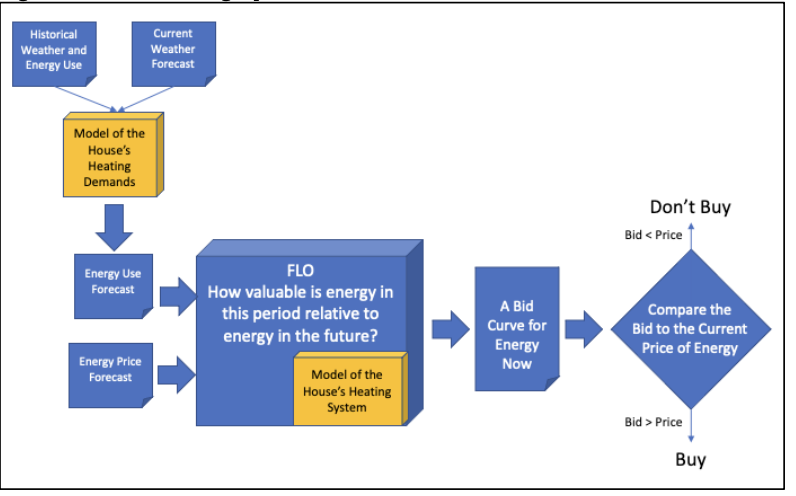

# Optimization of AWHP + TES performance

## Basic Control Strategies for Space Heat
A standard space heating system force hot water (or forced hot air) uses a very simple negative-feedback control strategy. A room thermostat measures the temperature in a zone that needs heating, and if the room temperature falls below the thermostat’s user-defined setpoint, it calls for heat from the heating system. This heat call generally turns on the heat distribution system – either a fan, a pump, or a valve – which in turn triggers the furnace or boiler to produce heat that gets distributed through the premises. When the room temperature reaches the desired setpoint, the thermostat stops calling for heat from the system, and it turns off. Most systems
will include a “hysteresis band” to avoid frequent cycling or “chatter.” Some systems may also employ proportional controls in which the power level of the heat distribution system depends on the difference between the setpoint and the current room temperature.

## Intertemporal tradeoffs

Once storage is added to a system, simple myopic control strategies no longer suffice: a forward-looking algorithmic approach is required. This is axiomatic and holds in situations far beyond residential storage heating systems: the whole point of storage is to separate in time the acquisition of a commodity (wheat from the farm, gasoline in your tank, energy to heat your house) from its consumption or use. To make a cost-effective decision about whether to add or remove something to or from storage, you must have some idea both of the expected timing of your future use of that thing, and what you think it will cost to acquire it later on.

## The role of forward looking optimizators (FLOs) in the GridWorks architecture

The SCADA system enters into a **representation contract** with its cloud-based agent, which GridWorks calls an Atomic Transactive Node or Atn. That representation contract allows the ATN to both 
  1) enter into dispatch contracts with the Scada, where the ATN can give commands to the SCADA about 
     a) amount of electricity to consume during the duraton of the dispatch contract; and
     b) depending on the specific contract, additional key optimization criteria (related to water temperature or which store to charge if there are multiple stores, for example)
  2) buy electricity on behalf of the SCADA in market structures.

The Atn is responsible for:
  1) Gathering information it needs to run optimizations
  2) Running the FLO
  3) Using the result of the FLO to bid into a market 
  4) Create and enter into a series of Dispatch Contracts with the SCADA to meet its market commitments.

The rest of this page gives more detail into the optimization techniques used for the MIT-licensed open source GridWorks FLOs. 

The output of the FLO is a **market bid** that gets sent to a GridWorks market maker and reflects the real-time **willingness to pay** for the heating system.

## GridWorks class of FLOs for AWHP + TES
GridWorks' approach to optimally control the heat pump and thermal energy storage system (HP+TES) is an innovative variant of Model Predictive Control (MPC), in which an optimization problem is solved periodically to inform control decisions.

GridWorks’ method leverages the current state of the system, weather and electricity price forecasts, and data-driven models of the heat pump, the energy and temperature of the store and the building to make the best decisions while always ensuring the home remains comfortably heated. For example, the algorithm dynamically selects the optimal water temperatures - both leaving the heat pump and entering the distribution system -  based on weather conditions and thermodynamic behavior, while also maximizing efficiency by accounting for the variation of the heat pump’s coefficient of performance (COP) with outdoor air temperature.

### Nomenclature

The optimization horizon is set to $H$ hours, which are divided into $N$ time steps so that time is discretized as $t=0,1,...,N$. At a given time $t$, the system's state is denoted by $x_t$ and the control input is denoted by $u_t$. The cost of taking input $u_t$ at the state $x_t$ is $c_t = f(u_t,x_t)$.

$$x_t \xrightarrow{u_t, c_t} x_{t+1}$$

The goal is to find the sequence of inputs $\vec{u} = (u_0, u_{1}, ..., u_{N-1}$) that, applied to the system in an initial state $x_{0}$, leads to a sequence of states $\vec{x} = (x_0 , x_1,...,x_N)$ such that the sum of costs $\sum_{t=0}^{N-1}c_t = \sum_{t=0}^{N-1} f(x_t, u_t)$ is minimized under a set of constraints.

In GridWorks' framework, a state variable $x$ represents the temperature distribution within the thermal storage tanks, while a control input $u$ corresponds to the electrical power supplied to the heat pump. The cost function to minimize is the associated electricity cost (along with soft constraints). Among the key constraints is the requirement that the temperature of the water supplied to the house must meet or exceed the Required Source Water Temperature (RSWT) at all times. The RSWT varies dynamically based on weather conditions and the building’s heating demands. The horizon is typically set to 48 hours with hourly time steps, meaning $H=N=48$.

### Ongoing work
GridWorks has included a new loop in the system that allows to control the heat pump's leaving water temperature. This increases the available flexibility when optimizing over the temperature of the water going to the storage and house.
This fundamental change in the system is easily incorporated in the current optimal control framework, as it simply requires adapting the model of the system dynamics.