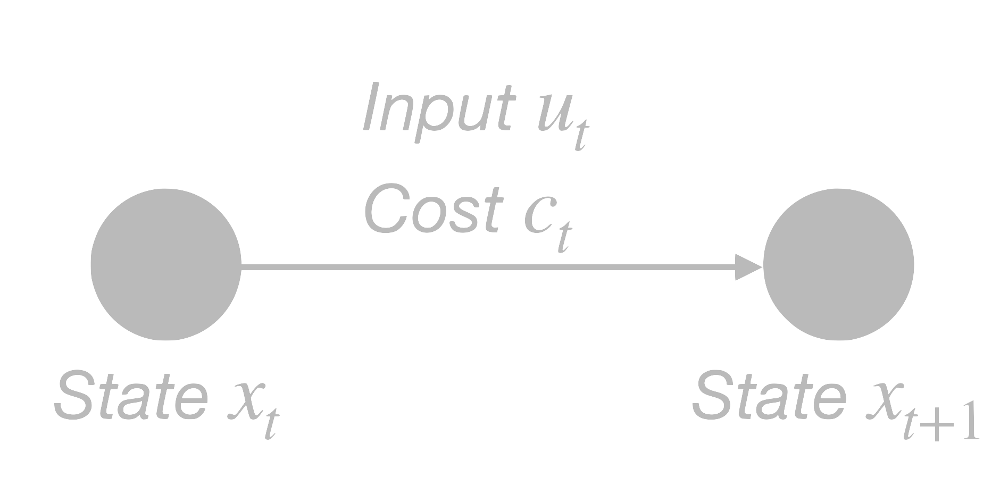

# Optimal control of the heat pump and thermal energy storage system

GridWorks' approach to optimally control the heat pump and thermal energy storage system (HP+TES) based on electricity prices is an innovative variant of Model Predictive Control (MPC), in which an optimization problem is solved periodically to inform control decisions. The optimization problem being solved ensures that the system minimizes the cost of electricity consumed by the heat pump over a specified time horizon, while ensuring that the house's heating load is always delivered, either through the heat pump or through the storage.

GridWorks’ method leverages the current state of the system, weather and electricity price forecasts, and data-driven models of both the heat pump and the building to make the best decisions. For example, the algorithm dynamically selects the optimal water temperature based on weather conditions and thermodynamic behavior, while also maximizing efficiency by accounting for the variation of the heat pump’s coefficient of performance (COP) with outdoor air temperature.

## Nomenclature

The optimization horizon is set to $H$ hours, which are divided into $N$ time steps so that time is discretized as $t=0,1,...,N$. At a given time $t$, the system's state is denoted by $x_t$ and the control input is denoted by $u_t$. 

$$x_t \xrightarrow{u_t} x_{t+1}$$

The goal is to find the sequence of inputs $\vec{u} = (u_0, u_{1}, ..., u_{N-1}$) that, applied to the system in an initial state $x_{0}$, leads to a sequence of states $\vec{x} = (x_0 , x_1,...,x_N)$ such that an objective function $f(\vec{u}, \vec{x})$ is minimized under a set of constraints.

In GridWorks' framework, a state variable $x$ represents the temperature distribution within the thermal storage tanks, while a control input $u$ corresponds to the electrical power supplied to the heat pump. The objective is to minimize the sum of electricity costs at each time step. Among the key constraints is the requirement that the temperature of the water supplied to the house must meet or exceed the Required Source Water Temperature (RSWT) at all times. The RSWT varies dynamically based on weather conditions and the building’s heating demands. The horizon is typically set to 48 hours with hourly time steps, meaning $H=N=48$.

## Optimization problem formulation

The main challenge in MPC is formulating the appropriate optimization problem. In existing literature, it is typically formulated as a continuous optimization problem, incorporating system dynamics as constraints. However, the inherent complexity of heat pump and thermal energy storage systems (characterized by discrete on/off and charge/discharge behavior, along with nonlinear dynamics) makes it challenging to model them in such a way without resulting in a Mixed-Integer Nonlinear Programming (MINLP) formulation, which is notoriously difficult to solve efficiently from a computational standpoint.

GridWorks' approach avoids this issue by recognizing that determining the optimal control sequence for a HP+TES system over time can be formulated as a shortest path problem. By defining a discrete set of feasible states at each time step, the problem can be modeled as a directed graph, where nodes represent available system states and edges represent valid transitions between them. Each edge is assigned a cost corresponding to the cost of electricity required to move from the tail node (state $x_t$) to the head node (state $x_{t+1}$) under the circumstances of that given time step (weather, house parameters, heat pump parameters, electricity price).

<u>Example computing edge cost</u>

Between times $t$ and $t+1$:

- Forecasted weather: $20 \degree F$ outside air, $2 \ mph$ wind
  - House heating load: $4 \ kWh$
  - House RSWT: $140\degree F$
  - Heat pump average COP: $2$

- Energy difference between state $x_{t+1}$ and $x_t$: $2 \ kWh$
  - Total heat output: $6 \ kWh$
  - Total electricity input: $3 \ kWh$

- Forecasted cost of electricity: $20 \ cts/kWh$
  - Cost of edge: $0.60\$$

Finding the optimal control trajectory between two states at different time steps is therefore reduced to identifying the lowest-cost path between the corresponding nodes in the graph. This is a well-established problem in computer science and can be solved efficiently using Dijkstra’s algorithm for shortest paths.

## Super-graphs
The approach presented above relies on identifying a well-chosen set of available states (nodes) and a system model that accurately defines the relationships between them (edges). For complex systems like the one developed by GridWorks, the number of nodes and edges needed to capture system behavior can be very large, making it computation computationally intensive to compute the available edges at each time step. However, GridWorks recognized that the edges calculated at each time step are actually a subset of a larger, static set of possible transitions. This insight enables the construction of a super-graph, a pre-computed graph containing all feasible nodes and edges, allowing the system to efficiently select only the relevant edges during runtime.